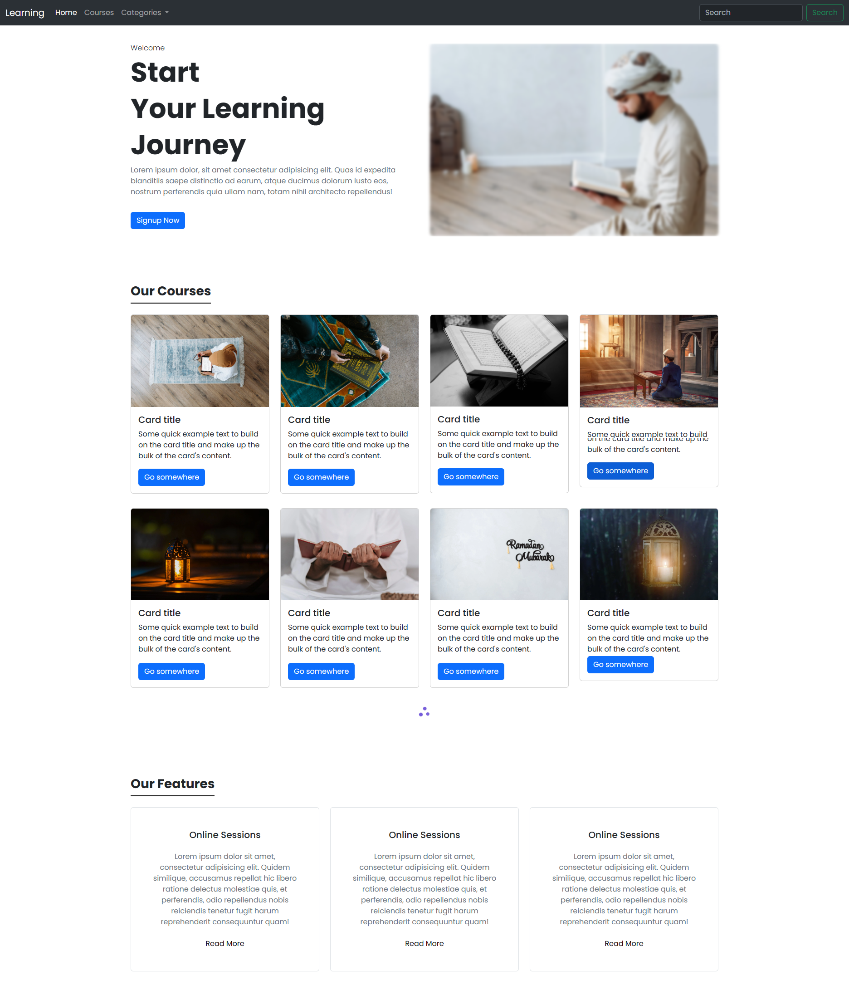

# bootsstrap page ⭐

Welcome to the Bootstrap Landing Page repository! This project showcases a sleek and modern landing page template built using Bootstrap, HTML, and CSS. It is designed to be versatile and easily customizable for various purposes such as product launches, portfolios, or business websites.

## Features

- Responsive design ensures compatibility across different devices and screen sizes.
- Clean and intuitive layout for a pleasant user experience.
- Easy-to-understand code structure, making it accessible for developers of all skill levels.
- Integration with Bootstrap components for quick customization and styling.

## Live Demo

To see the Bootstrap Landing Page in action, check out the [live demo](https://abdulrahim-ramadan.github.io/Bootstrap-Landing-page/).

## Screenshots



## Usage

1. **Clone the Repository:**

   Clone this repository to your local machine using the following command:

   ```bash
   git clone https://github.com/abdulrahim-ramadan/Bootstrap-Landing-page.git
   ```

2. **Open `index.html` in Your Browser:**

   After cloning the repository, navigate to the project directory and open the `index.html` file in your preferred web browser to view the landing page template.

3. **Customize as Needed:**

   Feel free to customize the content, styles, and layout of the landing page to suit your specific requirements. The template is built using Bootstrap, so you can leverage Bootstrap's documentation for guidance on customization.

## Contributing

Contributions are welcome! If you have any ideas, suggestions, or improvements, please don't hesitate to open an issue or submit a pull request. Your contributions can help enhance the functionality and usability of this landing page template for others.

## License

This project is licensed under the [MIT License](LICENSE). You are free to use, modify, and distribute the code for both personal and commercial purposes.


#Please ⭐ the repo to support our project .
